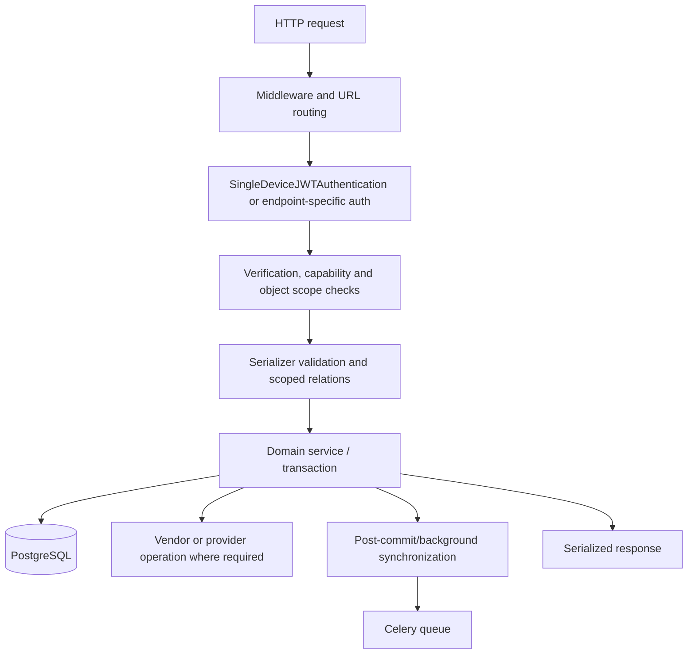

# Mermaid preview

## Request execution

```mermaid
flowchart TD
    Request["HTTP request"] --> Middleware["Middleware and URL routing"]
    Middleware --> Auth["SingleDeviceJWTAuthentication or endpoint-specific auth"]
    Auth --> Permission["Verification, capability and object scope checks"]
    Permission --> Validate["Serializer validation and scoped relations"]
    Validate --> Service["Domain service / transaction"]
    Service --> DB[("PostgreSQL")]
    Service --> Direct["Vendor or provider operation where required"]
    Service --> Deferred["Post-commit/background synchronization"]
    Deferred --> Worker["Celery queue"]
    Service --> Response["Serialized response"]
```

Click inside the diagram to edit its Mermaid source.
